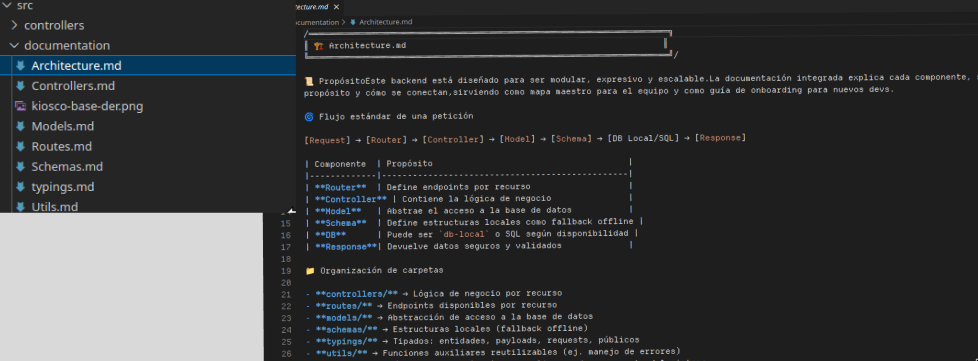

# 🍫🏪💰 KioscoApp Backend 🖥️🗄️📡

Este repositorio contiene el backend de [**KioscoApp**](https://github.com/lautarocantero/KioscoApp), una aplicación diseñada para la gestión de kioscos. Está desarrollado con **Node.js**, **Express** y **TypeScript**, y proporciona una API RESTful para autenticación, gestión de vendedores, productos, proveedores y ventas.

## 🧱 Arquitectura

| Componente      | Propósito                                                   | Ejemplo                  |
|-----------------|-------------------------------------------------------------|--------------------------|
| **Modelos**     | Encapsulan la lógica de acceso a datos y validación         | `AuthModel`              |
| **Controladores** | Manejan la lógica de negocio y las respuestas HTTP        | `auth.controller.ts`     |
| **Rutas**       | Definen los endpoints y delegan a los controladores         | `auth.routes.ts`         |

## 🧬 Diagrama Entidad-Relación (DER)

Este diagrama representa la estructura de datos de [**KioscoApp**](https://github.com/lautarocantero/KioscoApp):

 

## 🚀 Tecnologías utilizadas

- [Node.js](https://nodejs.org/)
- [Express](https://expressjs.com/)
- [TypeScript](https://www.typescriptlang.org/)
- [bcrypt](https://github.com/kelektiv/node.bcrypt.js) para el hash de contraseñas
- [db-local](https://www.npmjs.com/package/db-local) como base de datos local para desarrollo
- [JWT](https://www.jwt.io/) para autenticacion segura.

## 📦 Scripts disponibles

| Comando       | Descripción                                               |
|---------------|-----------------------------------------------------------|
| `npm run dev` | Inicia el servidor en modo desarrollo con `ts-node-dev`   |
| `npm run tsc` | Compila el proyecto TypeScript a JavaScript               |
| `npm start`   | Ejecuta el servidor desde la carpeta `build`              |

## 📁 Estructura del proyecto

src/  
├── controllers/   # Lógica de negocio (controladores)    
├── documentation/ # documentacion del proyecto  
├── models/        # Modelos y acceso a datos    
├── routes/        # Definición de rutas Express    
├── schemas/       # Definición de esquemas para db local    
├── typings/       # Tipos y contratos TypeScript    
├── utils/         # Funciones útiles compartidas    
├── config/        # Configuración general (ej: constantes)    
└── index.ts       # Punto de entrada principal    

## 🔐 Autenticación

El sistema de autenticación incluye:

- Registro de usuarios con validación de datos
- Hash de contraseñas con `bcrypt`
- Inicio de sesión y generación de tokens JWT

## 📚 Documentación

- Bloques teatrales con ASCII art para cada archivo (index, routes, controllers, models)
- Narrativa clara del flujo de datos: Client → Routes → Controllers → Models → DB
- Filosofía uniforme de local fallback vs SQL principal en todos los modelos
- Minimización en routers y archivos simples para evitar redundancia
- Meta‑guías y mapas arquitectónicos que muestran la relación entre capas (Schemas.md, Routes.md)
- Uso de emojis para dramatizar y hacer el onboarding más memorable

 

## 📌 Próximos pasos

- Validaciones adicionales con middlewares
- Agregar testing a los endpoints
- Agregar funciones que utilizen sql

## 🛠 Requisitos

- Node.js v18+
- npm o yarn
